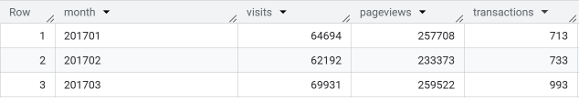
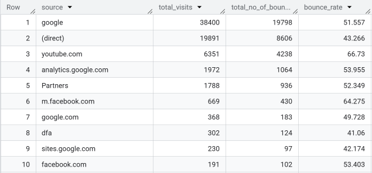
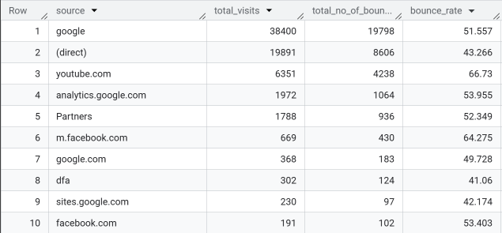
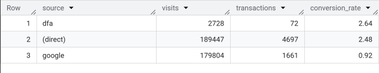
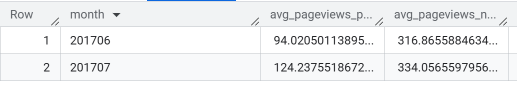
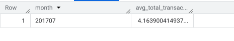
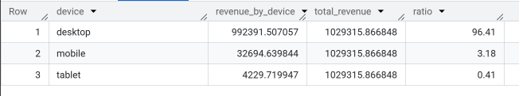
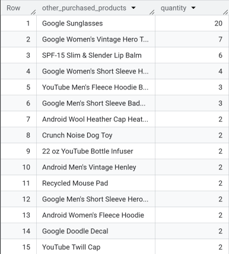
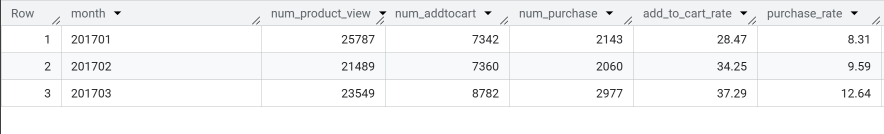
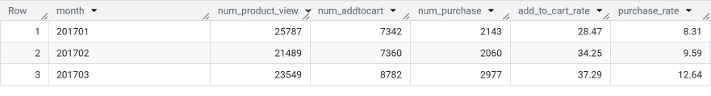

# 🛒 Google Analytics Ecommerce Analysis | BigQuery SQL


**Author:** Phan Minh Tan  
**Tools Used:** BigQuery, SQL, Google Analytics Sample Dataset  
**Dataset:** `bigquery-public-data.google_analytics_sample`

---

## 📑 Table of Contents

1. [📌 Background & Overview](#-background--overview)
2. [📂 Dataset Description](#-dataset-description)
3. [⚒️ Analysis Process](#️-analysis-process)
4. [📌 Key Insights](#-key-insights)
5. [🔎 Final Conclusion & Recommendations](#-final-conclusion--recommendations)
6. [🧠 What I Learned](#-what-i-learned)
7. [📁 Repository Structure](#-repository-structure)

---

## 📌 Background & Overview

### 📖 What is this project about?

This project uses **BigQuery SQL** to analyze ecommerce website performance from the **Google Analytics Sample Dataset**.  
The analysis focuses on traffic, engagement, revenue, purchaser behavior, device contribution, product funnel performance, and cumulative revenue growth.

The goal is to answer key business questions such as:

- How did website traffic, pageviews, transactions, and revenue change over time?
- Which traffic sources generated visits, revenue, bounce rate, and conversion rate?
- How do purchasers and non-purchasers behave differently?
- Which devices contributed the most revenue?
- What products are commonly purchased together?
- Where do users drop off in the product funnel?
- How does revenue accumulate weekly over time?


---

## 📂 Dataset Description

### 📌 Data Source

The dataset comes from the public **Google Analytics Sample Dataset** in BigQuery.

| Item | Description |
|---|---|
| Dataset | `bigquery-public-data.google_analytics_sample` |
| Main Table Pattern | `ga_sessions_*` |
| Platform | Google BigQuery |
| Data Type | Google Analytics ecommerce session data |
| Business Context | Google Merchandise Store ecommerce website |

---

## SQL Queries

---

## Query 01 — Monthly Website Performance

**Business question:**  
How many visits, pageviews, and transactions occurred in January, February, and March 2017?

```sql
-- ============================================================
-- Query 01
-- Calculate total visits, pageviews, and transactions
-- for Jan, Feb, and Mar 2017.
-- ============================================================

SELECT
  FORMAT_DATE('%Y%m', PARSE_DATE('%Y%m%d', date)) AS month,
  SUM(totals.visits) AS visits,
  SUM(totals.pageviews) AS pageviews,
  SUM(totals.transactions) AS transactions
FROM `bigquery-public-data.google_analytics_sample.ga_sessions_2017*`
WHERE _TABLE_SUFFIX BETWEEN '0101' AND '0331'
GROUP BY 1
ORDER BY 1;
```

**Result**



**Why it matters:**  
This query gives a high-level view of website performance over time.

---

## Query 02 — Bounce Rate by Traffic Source

**Business question:**  
Which traffic sources had the highest bounce rate in July 2017?

```sql
-- ============================================================
-- Query 02
-- Calculate bounce rate per traffic source in July 2017.
-- Bounce rate = total bounces / total visits * 100
-- ============================================================

SELECT
  trafficSource.source AS source,
  SUM(totals.visits) AS total_visits,
  SUM(totals.bounces) AS total_no_of_bounces,
  ROUND(SAFE_DIVIDE(SUM(totals.bounces), SUM(totals.visits)) * 100, 3) AS bounce_rate
FROM `bigquery-public-data.google_analytics_sample.ga_sessions_201707*`
GROUP BY 1
ORDER BY total_visits DESC;
```

**Result**



**Why it matters:**  
Bounce rate helps evaluate traffic quality, not just traffic volume.

---

## Query 03 — Revenue by Traffic Source

**Business question:**  
Which traffic sources generated the most revenue by month and week?

```sql
-- ============================================================
-- Query 03
-- Calculate revenue by traffic source by month and week.
-- Revenue is converted from micros by dividing by 1,000,000.
-- ============================================================

WITH month_data AS (
  SELECT
    'Month' AS time_type,
    FORMAT_DATE('%Y%m', PARSE_DATE('%Y%m%d', date)) AS time,
    trafficSource.source AS source,
    SUM(product.productRevenue) / 1000000 AS revenue
  FROM `bigquery-public-data.google_analytics_sample.ga_sessions_201706*`,
    UNNEST(hits) AS hits,
    UNNEST(hits.product) AS product
  WHERE product.productRevenue IS NOT NULL
  GROUP BY 1, 2, 3
),

week_data AS (
  SELECT
    'Week' AS time_type,
    FORMAT_DATE('%Y%W', PARSE_DATE('%Y%m%d', date)) AS time,
    trafficSource.source AS source,
    SUM(product.productRevenue) / 1000000 AS revenue
  FROM `bigquery-public-data.google_analytics_sample.ga_sessions_201706*`,
    UNNEST(hits) AS hits,
    UNNEST(hits.product) AS product
  WHERE product.productRevenue IS NOT NULL
  GROUP BY 1, 2, 3
)

SELECT
  time_type,
  time,
  source,
  revenue
FROM month_data

UNION ALL

SELECT
  time_type,
  time,
  source,
  revenue
FROM week_data

ORDER BY time_type, revenue DESC;
```

**Result**



**Why it matters:**  
Revenue by source helps identify acquisition channels that generate business value.

---

## Query 04 — Conversion Rate by Traffic Source

**Business question:**  
Which traffic sources converted visits into transactions most effectively in 2017?

```sql
-- ============================================================
-- Query 04
-- Calculate conversion rate by traffic source in 2017.
-- Conversion rate = transactions / visits * 100
-- Only include traffic sources with transactions >= 50.
-- ============================================================

SELECT
  trafficSource.source AS source,
  SUM(totals.visits) AS visits,
  SUM(totals.transactions) AS transactions,
  ROUND(SAFE_DIVIDE(SUM(totals.transactions), SUM(totals.visits)) * 100, 2) AS conversion_rate
FROM `bigquery-public-data.google_analytics_sample.ga_sessions_2017*`
WHERE _TABLE_SUFFIX BETWEEN '0101' AND '1231'
GROUP BY 1
HAVING transactions >= 50
ORDER BY conversion_rate DESC;
```

**Result**



**Why it matters:**  
Conversion rate shows how effectively each traffic source turns visits into purchases.

---

## Query 05 — Average Pageviews by Purchaser Type

**Business question:**  
Do purchasers view more pages than non-purchasers in June and July 2017?

```sql
-- ============================================================
-- Query 05
-- Calculate average number of pageviews by purchaser type
-- in June and July 2017.
-- Purchaser: totals.transactions >= 1 and productRevenue is not null
-- Non-purchaser: totals.transactions is null and productRevenue is null
-- ============================================================

WITH purchaser_data AS (
  SELECT
    FORMAT_DATE('%Y%m', PARSE_DATE('%Y%m%d', date)) AS month,
    SUM(totals.pageviews) / COUNT(DISTINCT fullVisitorId) AS avg_pageviews_purchase
  FROM `bigquery-public-data.google_analytics_sample.ga_sessions_2017*`,
    UNNEST(hits) AS hits,
    UNNEST(hits.product) AS product
  WHERE _TABLE_SUFFIX BETWEEN '0601' AND '0731'
    AND totals.transactions >= 1
    AND product.productRevenue IS NOT NULL
  GROUP BY 1
),

non_purchaser_data AS (
  SELECT
    FORMAT_DATE('%Y%m', PARSE_DATE('%Y%m%d', date)) AS month,
    SUM(totals.pageviews) / COUNT(DISTINCT fullVisitorId) AS avg_pageviews_non_purchase
  FROM `bigquery-public-data.google_analytics_sample.ga_sessions_2017*`,
    UNNEST(hits) AS hits,
    UNNEST(hits.product) AS product
  WHERE _TABLE_SUFFIX BETWEEN '0601' AND '0731'
    AND totals.transactions IS NULL
    AND product.productRevenue IS NULL
  GROUP BY 1
)

SELECT
  COALESCE(p.month, np.month) AS month,
  p.avg_pageviews_purchase,
  np.avg_pageviews_non_purchase
FROM purchaser_data AS p
FULL JOIN non_purchaser_data AS np
USING (month)
ORDER BY month;
```

**Result**



**Why it matters:**  
This helps compare browsing engagement between converting and non-converting users.

---

## Query 06 — Average Transactions per Purchasing User

**Business question:**  
How many transactions does each purchasing user make on average in July 2017?

```sql
-- ============================================================
-- Query 06
-- Calculate average number of transactions per purchasing user
-- in July 2017.
-- Average transactions per user = total transactions / unique purchasing users
-- ============================================================

SELECT
  FORMAT_DATE('%Y%m', PARSE_DATE('%Y%m%d', date)) AS month,
  SUM(totals.transactions) / COUNT(DISTINCT fullVisitorId) AS avg_total_transactions_per_user
FROM `bigquery-public-data.google_analytics_sample.ga_sessions_201707*`,
  UNNEST(hits) AS hits,
  UNNEST(hits.product) AS product
WHERE totals.transactions >= 1
  AND product.productRevenue IS NOT NULL
GROUP BY 1;
```

**Result**



**Why it matters:**  
This metric helps understand purchase frequency among users who actually bought something.

---

## Query 07 — Revenue Contribution by Device

**Business question:**  
Which device categories contributed the most revenue in 2017?

```sql
-- ============================================================
-- Query 07
-- Calculate revenue contribution by device in 2017.
-- Ratio = revenue by device / total revenue * 100
-- ============================================================

WITH device_revenue AS (
  SELECT
    device.deviceCategory AS device,
    SUM(product.productRevenue) / 1000000 AS revenue_by_device
  FROM `bigquery-public-data.google_analytics_sample.ga_sessions_2017*`,
    UNNEST(hits) AS hits,
    UNNEST(hits.product) AS product
  WHERE totals.transactions >= 1
    AND product.productRevenue IS NOT NULL
  GROUP BY 1
)

SELECT
  device,
  revenue_by_device,
  SUM(revenue_by_device) OVER () AS total_revenue,
  ROUND(SAFE_DIVIDE(revenue_by_device, SUM(revenue_by_device) OVER ()) * 100, 2) AS ratio
FROM device_revenue
ORDER BY ratio DESC;
```

**Result**



**Why it matters:**  
Device-level revenue contribution helps identify where customers generate the most value.

---

## Query 08 — Cross-Selling Product Analysis

**Business question:**  
What other products were purchased by customers who bought **YouTube Men's Vintage Henley** in July 2017?

```sql
-- ============================================================
-- Query 08
-- Find other products purchased by customers who purchased
-- "YouTube Men's Vintage Henley" in July 2017.
-- ============================================================

WITH buyers_list AS (
  SELECT DISTINCT
    fullVisitorId
  FROM `bigquery-public-data.google_analytics_sample.ga_sessions_201707*`,
    UNNEST(hits) AS hits,
    UNNEST(hits.product) AS product
  WHERE product.v2ProductName = "YouTube Men's Vintage Henley"
    AND product.productRevenue IS NOT NULL
    AND totals.transactions >= 1
)

SELECT
  product.v2ProductName AS other_purchased_products,
  SUM(product.productQuantity) AS quantity
FROM `bigquery-public-data.google_analytics_sample.ga_sessions_201707*`,
  UNNEST(hits) AS hits,
  UNNEST(hits.product) AS product
INNER JOIN buyers_list AS buyers
USING (fullVisitorId)
WHERE product.v2ProductName != "YouTube Men's Vintage Henley"
  AND product.productRevenue IS NOT NULL
  AND totals.transactions >= 1
GROUP BY 1
ORDER BY quantity DESC;
```

**Result**



**Why it matters:**  
This query supports cross-selling, product bundling, and recommendation strategies.

---

## Query 09 — Product Funnel Analysis

**Business question:**  
How do users move from product view to add-to-cart and purchase from January to March 2017?

```sql
-- ============================================================
-- Query 09
-- Product funnel analysis from product view to add-to-cart to purchase.
-- action_type = '2': product view
-- action_type = '3': add to cart
-- action_type = '6': purchase
-- ============================================================

WITH product_view AS (
  SELECT
    FORMAT_DATE('%Y%m', PARSE_DATE('%Y%m%d', date)) AS month,
    COUNT(product.productSKU) AS num_product_view
  FROM `bigquery-public-data.google_analytics_sample.ga_sessions_*`,
    UNNEST(hits) AS hits,
    UNNEST(hits.product) AS product
  WHERE _TABLE_SUFFIX BETWEEN '20170101' AND '20170331'
    AND hits.eCommerceAction.action_type = '2'
  GROUP BY 1
),

add_to_cart AS (
  SELECT
    FORMAT_DATE('%Y%m', PARSE_DATE('%Y%m%d', date)) AS month,
    COUNT(product.productSKU) AS num_addtocart
  FROM `bigquery-public-data.google_analytics_sample.ga_sessions_*`,
    UNNEST(hits) AS hits,
    UNNEST(hits.product) AS product
  WHERE _TABLE_SUFFIX BETWEEN '20170101' AND '20170331'
    AND hits.eCommerceAction.action_type = '3'
  GROUP BY 1
),

purchase AS (
  SELECT
    FORMAT_DATE('%Y%m', PARSE_DATE('%Y%m%d', date)) AS month,
    COUNT(product.productSKU) AS num_purchase
  FROM `bigquery-public-data.google_analytics_sample.ga_sessions_*`,
    UNNEST(hits) AS hits,
    UNNEST(hits.product) AS product
  WHERE _TABLE_SUFFIX BETWEEN '20170101' AND '20170331'
    AND hits.eCommerceAction.action_type = '6'
    AND product.productRevenue IS NOT NULL
  GROUP BY 1
)

SELECT
  pv.month,
  pv.num_product_view,
  COALESCE(a.num_addtocart, 0) AS num_addtocart,
  COALESCE(p.num_purchase, 0) AS num_purchase,
  ROUND(SAFE_DIVIDE(COALESCE(a.num_addtocart, 0), pv.num_product_view) * 100, 2) AS add_to_cart_rate,
  ROUND(SAFE_DIVIDE(COALESCE(p.num_purchase, 0), pv.num_product_view) * 100, 2) AS purchase_rate
FROM product_view AS pv
LEFT JOIN add_to_cart AS a
USING (month)
LEFT JOIN purchase AS p
USING (month)
ORDER BY pv.month;
```

**Result**



**Why it matters:**  
Funnel analysis helps identify where users drop off before completing a purchase.

---

## Query 10 — Weekly Cumulative Revenue

**Business question:**  
How did weekly revenue and cumulative revenue change from May to July 2017?

```sql
-- ============================================================
-- Query 10
-- Calculate weekly revenue from May to July 2017
-- and cumulative revenue.
-- ============================================================

WITH raw_data AS (
  SELECT
    FORMAT_DATE('%Y-%W', PARSE_DATE('%Y%m%d', date)) AS week,
    SUM(product.productRevenue) / 1000000 AS weekly_revenue
  FROM `bigquery-public-data.google_analytics_sample.ga_sessions_2017*`,
    UNNEST(hits) AS hits,
    UNNEST(hits.product) AS product
  WHERE _TABLE_SUFFIX BETWEEN '0501' AND '0731'
    AND product.productRevenue IS NOT NULL
  GROUP BY 1
)

SELECT
  week,
  ROUND(weekly_revenue, 2) AS weekly_revenue,
  ROUND(
    SUM(weekly_revenue) OVER (
      ORDER BY week
      ROWS BETWEEN UNBOUNDED PRECEDING AND CURRENT ROW
    ),
    2
  ) AS cumulative_revenue
FROM raw_data
ORDER BY week;
```

**Result**



**Why it matters:**  
Cumulative revenue helps track revenue growth momentum over time.

---
## 📌 Key Insights

- Website performance can be monitored through visits, pageviews, transactions, and revenue by time period.
- Traffic sources should be evaluated by both volume and quality because high visits do not always mean high engagement or high conversion.
- Revenue by source and conversion rate by source help identify which channels contribute most to ecommerce outcomes.
- Purchasers and non-purchasers show different browsing behavior, which can support segmentation and remarketing strategy.
- Device-level revenue contribution helps understand which platforms generate the most value.
- Cross-selling analysis can reveal product combinations that are useful for recommendation campaigns.
- Funnel analysis helps identify where users drop off before completing a purchase.
- Cumulative revenue analysis helps track revenue growth over time.

---

## 🔎 Final Conclusion & Recommendations

| Area | Insight | Recommendation |
|---|---|---|
| Traffic Performance | Website traffic should be tracked together with pageviews, transactions, and revenue. | Monitor monthly performance to detect growth or decline early. |
| Traffic Source Quality | Some sources may generate many visits but also high bounce rates or weak conversion. | Optimize landing pages and messaging for low-quality traffic sources. |
| Revenue Contribution | Revenue varies by traffic source, time period, and device category. | Focus marketing effort on sources and devices that generate stronger revenue contribution. |
| Conversion Performance | Conversion rate shows which sources turn visits into transactions more effectively. | Prioritize channels with strong conversion rate and investigate sources with weak conversion. |
| Purchaser Behavior | Purchasers and non-purchasers can behave differently in pageview and transaction patterns. | Use behavioral differences to improve segmentation and remarketing. |
| Cross-Selling | Customers who buy one product may also purchase related products. | Use product pairing insights to create recommendation or bundle strategies. |
| Funnel Conversion | Users may drop off between product view, add-to-cart, and purchase. | Improve product pages, checkout flow, and promotional triggers to increase conversion rate. |
| Revenue Growth | Weekly cumulative revenue helps show how revenue builds over time. | Track cumulative revenue to evaluate business momentum and campaign impact. |

---

## 🧠 What I Learned

Through this project, I practiced how to:

- Query nested Google Analytics data in BigQuery using `UNNEST()`.
- Transform date fields and aggregate metrics by month and week.
- Calculate ecommerce metrics such as visits, pageviews, transactions, bounce rate, revenue, conversion rate, and funnel rates.
- Compare purchaser and non-purchaser behavior using SQL.
- Analyze revenue contribution by traffic source and device category.
- Build funnel analysis from product view to add-to-cart to purchase.
- Use window functions to calculate total contribution and cumulative revenue.
- Translate business questions into SQL logic and analytical outputs.

---


## 👤 Author

**Phan Minh Tan**  
Aspiring Data Analyst with interests in SQL, Power BI, Python, and business analytics.
