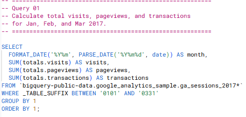
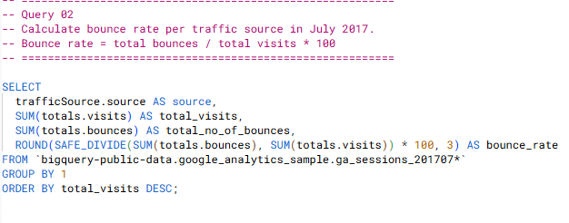
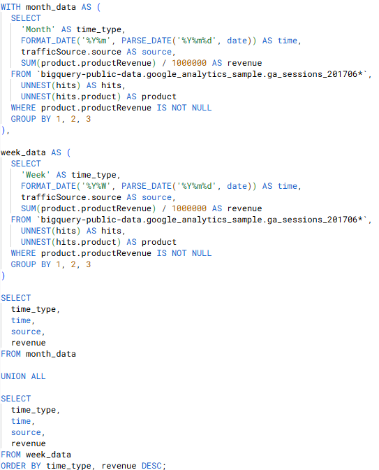
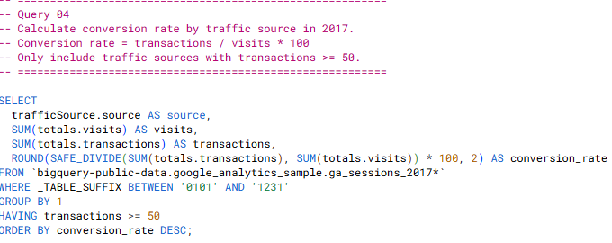
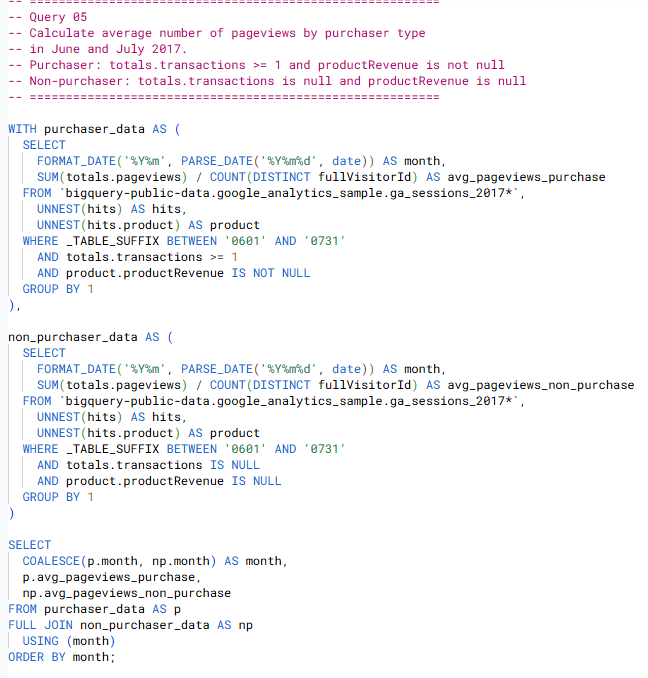
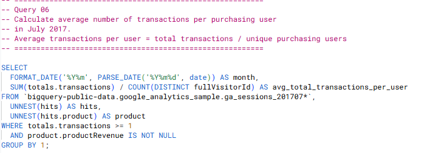
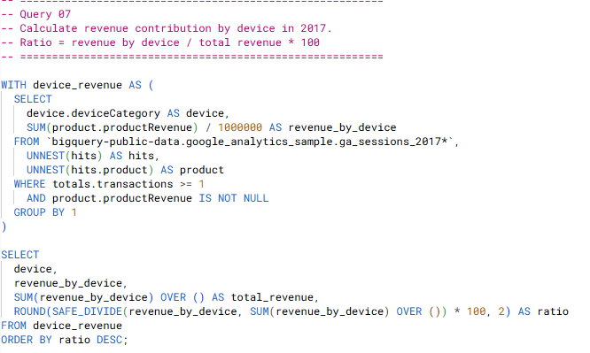
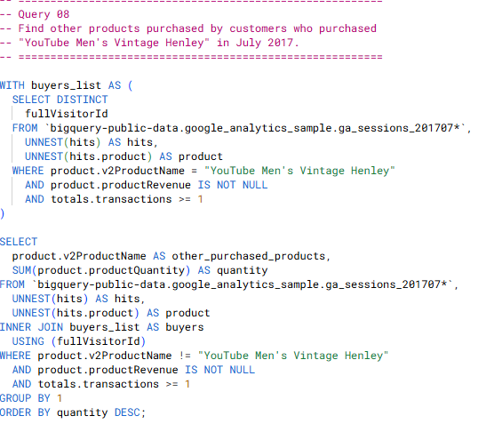
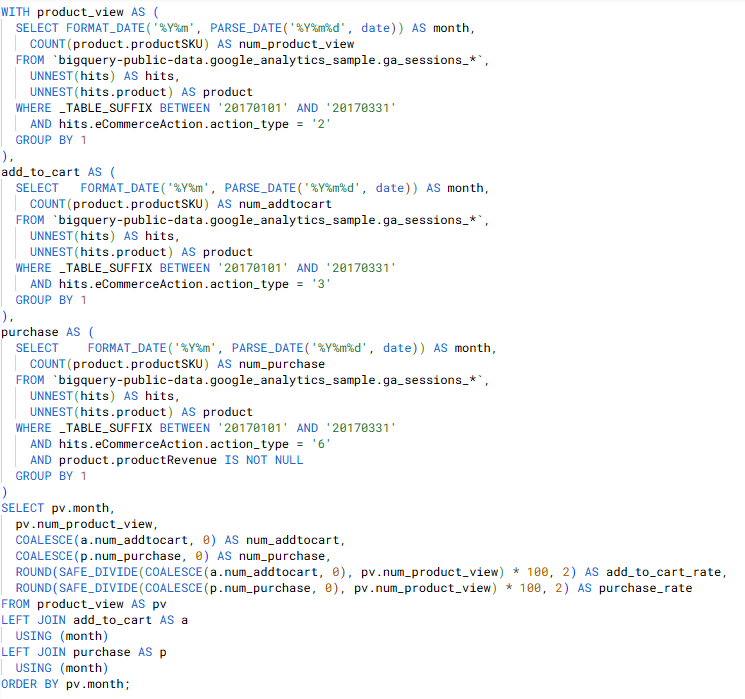
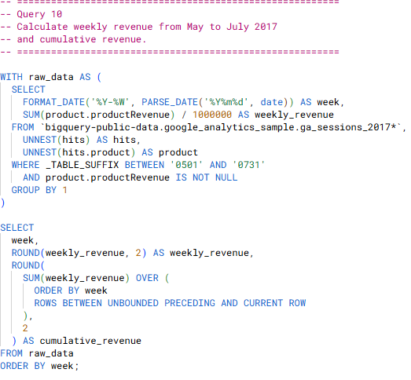

# 🛒 Google Analytics Ecommerce Analysis | BigQuery SQL


**Author:** Phan Minh Tan  
**Tools Used:** BigQuery, SQL, Google Analytics Sample Dataset  
**Dataset:** `bigquery-public-data.google_analytics_sample`

---

## 📑 Table of Contents

1. [📌 Background & Overview](#-background--overview)
2. [📂 Dataset Description](#-dataset-description)
3. [⚒️ Analysis Process](#️-analysis-process)
4. [📌 Key Insights](#-key-insights)
5. [🔎 Final Conclusion & Recommendations](#-final-conclusion--recommendations)
6. [🧠 What I Learned](#-what-i-learned)
7. [📁 Repository Structure](#-repository-structure)

---

## 📌 Background & Overview

### 📖 What is this project about?

This project uses **BigQuery SQL** to analyze ecommerce website performance from the **Google Analytics Sample Dataset**.  
The analysis focuses on traffic, engagement, revenue, purchaser behavior, device contribution, product funnel performance, and cumulative revenue growth.

The goal is to answer key business questions such as:

- How did website traffic, pageviews, transactions, and revenue change over time?
- Which traffic sources generated visits, revenue, bounce rate, and conversion rate?
- How do purchasers and non-purchasers behave differently?
- Which devices contributed the most revenue?
- What products are commonly purchased together?
- Where do users drop off in the product funnel?
- How does revenue accumulate weekly over time?

### 👤 Who is this project for?

- Data Analysts and Business Analysts
- Ecommerce Managers
- Digital Marketing Teams
- BI Teams
- Stakeholders who monitor website and purchase performance

### 🎯 Project Outcome

This project delivers a set of **10 BigQuery SQL queries** that help analyze:

- Monthly website performance
- Bounce rate by traffic source
- Revenue by traffic source
- Conversion rate by traffic source
- Purchaser vs non-purchaser behavior
- Average transactions per purchasing user
- Revenue contribution by device
- Cross-selling opportunities
- Product funnel conversion from view to add-to-cart to purchase
- Weekly cumulative revenue

---

## 📂 Dataset Description

### 📌 Data Source

The dataset comes from the public **Google Analytics Sample Dataset** in BigQuery.

| Item | Description |
|---|---|
| Dataset | `bigquery-public-data.google_analytics_sample` |
| Main Table Pattern | `ga_sessions_*` |
| Platform | Google BigQuery |
| Data Type | Google Analytics ecommerce session data |
| Business Context | Google Merchandise Store ecommerce website |

### 📊 Dataset Structure

The dataset contains session-level website activity with nested fields such as:

| Field Group | Description |
|---|---|
| `totals` | Session metrics such as visits, pageviews, transactions, bounces, and revenue |
| `trafficSource` | Traffic source information such as source, medium, and campaign |
| `device` | Device category used by visitors |
| `hits` | Nested hit-level user interactions within each session |
| `hits.product` | Nested product-level ecommerce actions and revenue |
| `eCommerceAction` | Ecommerce journey actions such as product view, add-to-cart, and purchase |

### 🧩 Important SQL Concepts Used

- `UNNEST()` to work with nested and repeated fields
- `PARSE_DATE()` and `FORMAT_DATE()` for date transformation
- Common Table Expressions / CTEs
- Aggregation with `SUM()`, `COUNT()`, and `COUNT(DISTINCT)`
- Conditional filtering with `WHERE`
- `JOIN`, `FULL JOIN`, and subqueries
- `SAFE_DIVIDE()` to avoid division errors
- Window functions for ratio and cumulative revenue calculation
- Funnel rate calculation
- Revenue conversion from micros to standard currency format

---

## ⚒️ Analysis Process

### 1️⃣ Monthly Website Performance

**Business Question:**  
How did visits, pageviews, and transactions perform across January, February, and March 2017?

**SQL Query**



**Query Result**


**Key Finding**

- Monthly traffic and transaction metrics help monitor overall ecommerce website performance over time.

---

### 2️⃣ Bounce Rate by Traffic Source

**Business Question:**  
Which traffic sources bring users with low engagement or high bounce behavior?

**SQL Query**



**Query Result**


**Key Finding**

- Bounce rate helps evaluate traffic quality, not only traffic volume.

---

### 3️⃣ Revenue by Traffic Source

**Business Question:**  
Which traffic sources generated the most revenue in June 2017 by week and by month?

**SQL Query**



**Query Result**


**Key Finding**

- Revenue by source helps identify which acquisition channels contribute most to ecommerce performance.

---

### 4️⃣ Conversion Rate by Traffic Source

**Business Question:**  
Which traffic sources convert visits into transactions most effectively?

**SQL Query**



**Query Result**


**Key Finding**

- Conversion rate shows traffic effectiveness by comparing transactions against total visits.

---

### 5️⃣ Purchaser vs Non-Purchaser Pageviews

**Business Question:**  
Do purchasers view more pages than non-purchasers?

**SQL Query**



**Query Result**


**Key Finding**

- Comparing purchaser and non-purchaser behavior helps understand engagement differences before conversion.

---

### 6️⃣ Average Transactions per Purchasing User

**Business Question:**  
How many transactions does each purchasing user make on average in July 2017?

**SQL Query**



**Query Result**


**Key Finding**

- Average transactions per purchasing user helps evaluate purchase frequency and repeat buying behavior.

---

### 7️⃣ Revenue Contribution by Device

**Business Question:**  
Which device categories contributed the most ecommerce revenue in 2017?

**SQL Query**



**Query Result**


**Key Finding**

- Device revenue contribution helps evaluate where customers are generating the most business value.

---

### 8️⃣ Cross-Selling Product Analysis

**Business Question:**  
What other products were purchased by customers who bought **YouTube Men's Vintage Henley** in July 2017?

**SQL Query**



**Query Result**


**Key Finding**

- Product co-purchase analysis can support cross-selling, bundling, and recommendation strategies.

---

### 9️⃣ Product Funnel Analysis

**Business Question:**  
How do users move from product view to add-to-cart and purchase in January, February, and March 2017?

**SQL Query**



**Query Result**


**Key Finding**

- Funnel analysis helps identify where users drop off before completing a purchase.

---

### 🔟 Weekly Cumulative Revenue

**Business Question:**  
How did weekly revenue and cumulative revenue change from May to July 2017?

**SQL Query**



**Query Result**


**Key Finding**

- Weekly cumulative revenue helps track revenue growth momentum over time.

---

## 📌 Key Insights

- Website performance can be monitored through visits, pageviews, transactions, and revenue by time period.
- Traffic sources should be evaluated by both volume and quality because high visits do not always mean high engagement or high conversion.
- Revenue by source and conversion rate by source help identify which channels contribute most to ecommerce outcomes.
- Purchasers and non-purchasers show different browsing behavior, which can support segmentation and remarketing strategy.
- Device-level revenue contribution helps understand which platforms generate the most value.
- Cross-selling analysis can reveal product combinations that are useful for recommendation campaigns.
- Funnel analysis helps identify where users drop off before completing a purchase.
- Cumulative revenue analysis helps track revenue growth over time.

---

## 🔎 Final Conclusion & Recommendations

| Area | Insight | Recommendation |
|---|---|---|
| Traffic Performance | Website traffic should be tracked together with pageviews, transactions, and revenue. | Monitor monthly performance to detect growth or decline early. |
| Traffic Source Quality | Some sources may generate many visits but also high bounce rates or weak conversion. | Optimize landing pages and messaging for low-quality traffic sources. |
| Revenue Contribution | Revenue varies by traffic source, time period, and device category. | Focus marketing effort on sources and devices that generate stronger revenue contribution. |
| Conversion Performance | Conversion rate shows which sources turn visits into transactions more effectively. | Prioritize channels with strong conversion rate and investigate sources with weak conversion. |
| Purchaser Behavior | Purchasers and non-purchasers can behave differently in pageview and transaction patterns. | Use behavioral differences to improve segmentation and remarketing. |
| Cross-Selling | Customers who buy one product may also purchase related products. | Use product pairing insights to create recommendation or bundle strategies. |
| Funnel Conversion | Users may drop off between product view, add-to-cart, and purchase. | Improve product pages, checkout flow, and promotional triggers to increase conversion rate. |
| Revenue Growth | Weekly cumulative revenue helps show how revenue builds over time. | Track cumulative revenue to evaluate business momentum and campaign impact. |

---

## 🧠 What I Learned

Through this project, I practiced how to:

- Query nested Google Analytics data in BigQuery using `UNNEST()`.
- Transform date fields and aggregate metrics by month and week.
- Calculate ecommerce metrics such as visits, pageviews, transactions, bounce rate, revenue, conversion rate, and funnel rates.
- Compare purchaser and non-purchaser behavior using SQL.
- Analyze revenue contribution by traffic source and device category.
- Build funnel analysis from product view to add-to-cart to purchase.
- Use window functions to calculate total contribution and cumulative revenue.
- Translate business questions into SQL logic and analytical outputs.

---

## 📁 Repository Structure

```text
google-analytics-ecommerce-sql-bigquery/
│
├── query/
│   ├── 01_monthly_website_performance.sql
│   ├── 02_bounce_rate_by_traffic_source.sql
│   ├── 03_revenue_by_traffic_source.sql
│   ├── 04_conversion_rate_by_traffic_source.sql
│   ├── 05_avg_pageviews_by_purchaser_type.sql
│   ├── 06_avg_transactions_per_purchasing_user.sql
│   ├── 07_revenue_contribution_by_device.sql
│   ├── 08_cross_selling_product_analysis.sql
│   ├── 09_product_funnel_analysis.sql
│   └── 10_weekly_cumulative_revenue.sql
│
├── image/
│   ├── cover.png
│   ├── query/
│   │   ├── 01_monthly_website_performance_query.png
│   │   ├── 02_bounce_rate_by_traffic_source_query.png
│   │   ├── 03_revenue_by_traffic_source_query.png
│   │   ├── 04_conversion_rate_by_traffic_source_query.png
│   │   ├── 05_avg_pageviews_by_purchaser_type_query.png
│   │   ├── 06_avg_transactions_per_purchasing_user_query.png
│   │   ├── 07_revenue_contribution_by_device_query.png
│   │   ├── 08_cross_selling_product_analysis_query.png
│   │   ├── 09_product_funnel_analysis_query.png
│   │   └── 10_weekly_cumulative_revenue_query.png
│   │
│   └── result/
│       ├── 01_monthly_website_performance_result.png
│       ├── 02_bounce_rate_by_traffic_source_result.png
│       ├── 03_revenue_by_traffic_source_result.png
│       ├── 04_conversion_rate_by_traffic_source_result.png
│       ├── 05_avg_pageviews_by_purchaser_type_result.png
│       ├── 06_avg_transactions_per_purchasing_user_result.png
│       ├── 07_revenue_contribution_by_device_result.png
│       ├── 08_cross_selling_product_analysis_result.png
│       ├── 09_product_funnel_analysis_result.png
│       └── 10_weekly_cumulative_revenue_result.png
│
└── README.md
```

---

## 🚀 How to Use

1. Open Google BigQuery.
2. Use the public dataset: `bigquery-public-data.google_analytics_sample`.
3. Open each SQL file in the `query/` folder.
4. Run the queries and review the result screenshots.
5. Use the insights to understand ecommerce traffic, revenue, purchase behavior, device contribution, and funnel performance.

---

## 👤 Author

**Phan Minh Tan**  
Aspiring Data Analyst with interests in SQL, Power BI, Python, and business analytics.
